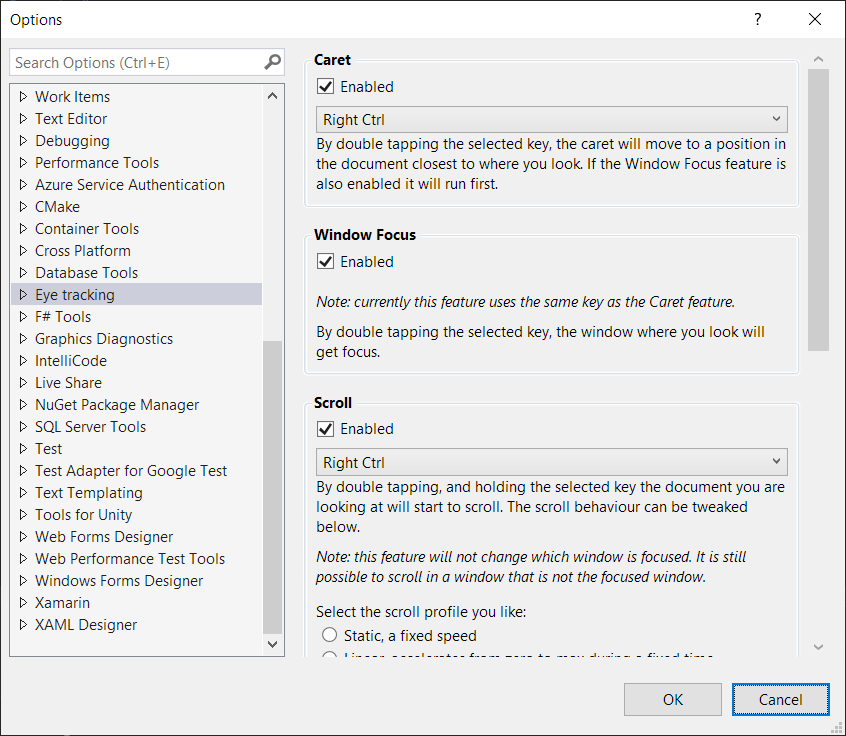

# Eye Tracking for Visual Studio

Extension for Visual Studio using eye tracking

## Status

Branch | Status | Download
------ | ------ | --------
master |   | [CI Build](http://vsixgallery.com/extension/65bd244c-48a0-46af-953a-0fb433e5343d/)
develop | 

See the [change log](CHANGELOG.md) for changes and road map.

## Configuration

All features can be enabled or disabled. Some features have more parameters that can be tweaked. All options are available under the Visual Studio tools menu.

    Tools -> Options... -> Eye tracking

## Features

All features are a based on what you can do with your keyboard when it is augmented by the input from an eye tracker.

### Scrolling

Keyboard: Double-tap and hold the right Ctrl-key (key is configurable)

Basic scrolling. While holding down the Ctrl-key, the document will scroll.
Depending on which scroll profile is selected, the scroll will behave slightly different.

For all profiles except _Dynamic_ the base functionality is, if you looked in the upper half of the editor view when double tapping the key, the scroll direction is up.
And when you look in the lower half of the editor view, the scroll direction is down.

These are the available scroll profiles:

- _Static_: with no fancy acceleration/deacceleration just a constant scroll speed.
- _Linear_: You can specify how long it will take to accelerate to max scroll speed.
- _Exponential_: Has both acceleration and deacceleration (inertial).
- _Dynamic_: Continuously modifies the scroll speed, and direction, depending on distance between your current gaze point and the vertical center of the document window.

### Move caret

Keyboard: Double-tap (and release) the right Ctrl-key (key is configurable)

Basic way of moving the caret to where you look.

### Window focus

Keyboard: (currently shares the same command as Move caret)

Will set the window you look at as the active/focused window. This only applies to Visual Studio windows. A Visual Studio window can be free floating or docked in a window frame set. Supported windows include Document windows (usually code files) and Tool windows (Solution Explorer Output, Team Explorer etc.).
